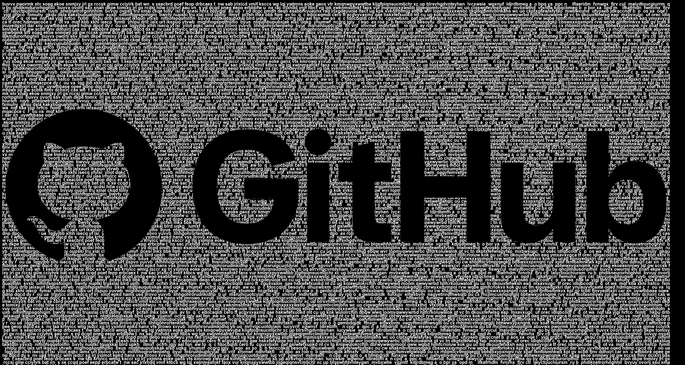

# Image Masking in HTML Canvas

This tool generates random string and use that string to mask the input image creating "fake ascii art" effect.
[Try it yourself here](https://jonel-code.github.io/random-text-image-masking/?tl=100000&s=101&i=https://brand.github.com/_next/static/media/logo-03.cc5e5332.png)

### Query Parameters:
- `i` : url of the image to mask. 
- `s` : a number used for the seed of the random string (ex. 9932)
- `tl` : length of the text to generate. (ex. 10000)

#### Sample
-  `?tl=100000&s=101&i=https://brand.github.com/_next/static/media/logo-03.cc5e5332.png`
